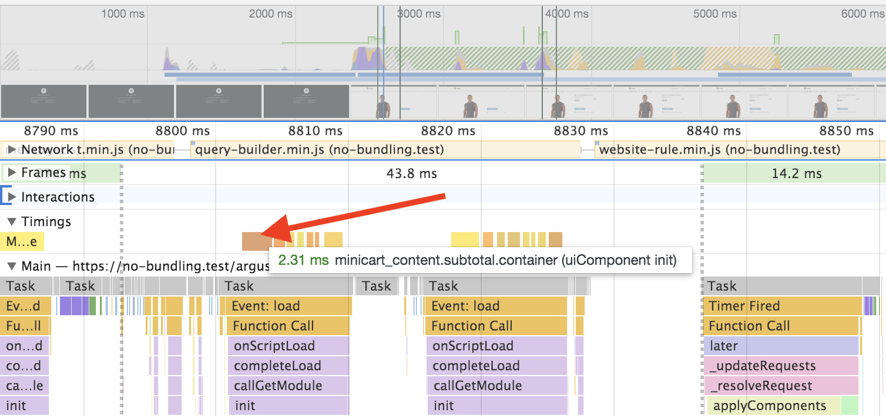

# Perfmarks

A [Magento 2](https://github.com/magento/magento2) module that instruments the storefront with timing metrics using the web platform's [User Timing API](https://developer.mozilla.org/en-US/docs/Web/API/User_Timing_API/Using_the_User_Timing_API).

## How to Use

Install the module in your Magento 2 store as you would any other module. Make sure you flush the cache and re-deploy your storefront after the module is installed.

Then, you can use the profiler in (most) modern browsers to surface the timings collected.

## What is Tracked?

1. `mage-init` widget initialization
2. uiComponent initialization

Suggest more :)

## How Does It Work?

It's a bunch of copypasta from Magento core with some instrumentation added